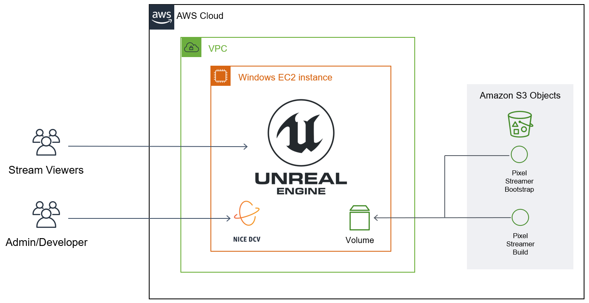

# Deploying Unreal Engine Pixel Streaming Server on EC2

This sample is for those who use Unreal Engine 4 to build content and wish to deploy this content to an audience via UE4 pixel streams. Content examples include but are not limited to: interactive entertainment, architectural visualization, high fidelity car configurators, or anyone who needs to let users access high quality interactive content via thin clients such as web browsers.

This sample deployment should take about 1 hour to complete, assuming you have an application with Pixel Streaming enabled. The 1-hour deployment includes:
1. Creating an AWS account with proper permissions
1. Creating the S3 bucket and uploading required files to S3
1. Configuring CloudFormation template to be launched

If you do not have an application with Pixel Streaming, please go to [the getting started with Pixel Streaming guide](https://docs.unrealengine.com/4.26/en-US/SharingAndReleasing/PixelStreaming/PixelStreamingIntro/).

## Working with UE4 Pixel Streaming on AWS

Using AWS and Unreal Engine 4’s Pixel Streaming solution, developers can create content with Unreal Engine and deploy on AWS so users can engage with the content from any modern Web browser. A build of the UE4 content is run on an Amazon Elastic Compute Cloud (Amazon EC2) G4 instance. G4 instances are GPU instances that are designed for graphics-intensive workloads and offer a powerful, low-cost, pay-as-you-go model which is ideal for on-demand interactive content.

This Quick Start deployment sets up an EC2 environment on AWS that includes the following:

* [Unreal Engine 4 Pixel Streaming](https://docs.unrealengine.com/en-US/Platforms/PixelStreaming/index.html) components from your pixel streaming build are installed and run on startup. Components include UE4 Windows build with pixel streaming plug-in executable, Stun Server, Turn Server, and Signaling Web Server.
* [Nice DCV](https://www.google.com/url?sa=t&rct=j&q=&esrc=s&source=web&cd=&cad=rja&uact=8&ved=2ahUKEwjegIuN6YLsAhUIna0KHdNXCBwQFjAAegQIAxAB&url=https%3A%2F%2Faws.amazon.com%2Fhpc%2Fdcv%2F&usg=AOvVaw3zloCNRymwGNnFAuD7OP3M) is installed allowing developers to connect to the G4 instance, for a low latency remote desktop experience that supports resolutions up to 4k. This allows a developer to remote in to test the build and optionally installUnreal Engine 4 directly on the machine.

## Deployment Guide

Follow the steps outlined in the [Unreal Engine Pixel Streaming Deployment Guide](Documentation/Unreal-Engine-Pixel-Streaming-Deployment-Guide.pdf). Once deployed the CloudFormation stack will deploy the below architecture:

## CloudFormation Template Parameters

  | Parameters                      | Details                                                                                   | Default Value      |
  | ---------------------------     |:------------------------------------------------------------------------------------------|:-------------------|
  |InstanceType                     | Amazon EC2 instance type for the pixel streaming server. Size should be smallest instance size that achieves required performance. | g4dn.xlarge |
  |OsVersion                        | Specify the version of Windows(Windows Server 2019) OS to use. Valid values are “WindowsServer2019”, “WindowsServer2016”, or “WindowsServer2012R2”. |  Windows Server 2019 |
  |DiskSize                         | Volume size for the host, in GB.  | 50 |
  |KeyPairName                      | Name of AWS EC2 Key Pair. This is not used when logging into machine, but needed to secure instance on VPC. | Requires input |
  |UserPasswd                       | Windows Administrator password used for logging into EC2 via NICE DCV or other administration. It is recommended that you change this default password. | Ch4ng3M3! |
  |PixelStreamerBootstrapLocation   | Specify the location of bootstrap file in S3 which is executed upon initial launch of EC2 instance.    | Requires input |
  |PixelStreamerBuildLocation       | Specify the location of UE4 Pixel Streamer build zip file in S3. | Requires input |
  |PixelStreamingAccessCIDR         | IP address range, as an access CIDR, of pixel stream viewers. If your viewers are coming from a specific range, limit the access. | 0.0.0.0/0 |
  |NiceDCVAccessCIDR                | IP address range, as an access CIDR, of admins and developers to access server via NICE DCV. It is recommended that you limit this to only trusted IPs, such as specifying your own IP. | 0.0.0.0/0 |
  |Windows AMIs                     | Default values ensure that the latest Windows AMI published by AWS is used. You can also define a different AMI to use with a different path. | AWS Defined AMI Paths |

## Additional Resources

* Unreal Engine Pixel Streaming Documentation - <https://docs.unrealengine.com/en-US/Platforms/PixelStreaming/index.html>
* Amazon EC2 - <https://docs.aws.amazon.com/AWSEC2/latest/WindowsGuide/>
* AWS CloudFormation - <https://aws.amazon.com/documentation/cloudformation/>

## Solution Notes

* This solution supports launching of one instance of a UE4 Pixel Streamer. Once you have a successful instance you can create an AMI and setup an Auto Scaling group following AWS best practices. You would need to track the launched instances and IP addresses that are available to suit your use case. Refer to the links below to get started:
  * Create a custom Windows AMI - <https://docs.aws.amazon.com/AWSEC2/latest/WindowsGuide/Creating_EBSbacked_WinAMI.html>
  * Getting started with Amazon EC2 Auto Scaling - <https://docs.aws.amazon.com/autoscaling/ec2/userguide/GettingStartedTutorial.html>
* NVIDIA driver used is the default Tesla drivers. DirectX drivers are installed by the Unreal Engine prerequisite installer. NVIDIA gaming drivers can be used by remoting into the instance and installing based on the steps in the [NVIDIA EC2 driver documentation](https://docs.aws.amazon.com/AWSEC2/latest/WindowsGuide/install-nvidia-driver.html#nvidia-gaming-driver).

## Security

There are several security-related aspects of the architecture in this sample. The solution is deployed into the default VPC. It creates a security group that allows fine-grained control of traffic in and out of the EC2 hosting the Pixel Streaming server. You can limit access to IP addresses that need to access the host (see the HostAccessCIDR parameter earlier in this guide). This helps keep the host protected from malicious attacks and helps protect the data (UE4 Pixel Streaming build, in this case).

## License

This library is licensed under the MIT-0 License. See the LICENSE file.
